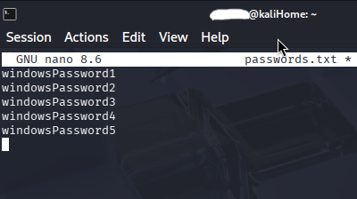
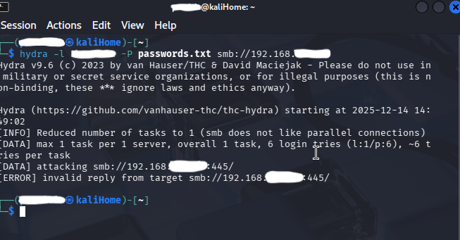
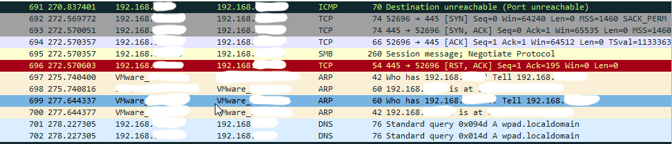

# Brute Force Detection Lab

## Overview
This lab simulates an unauthorized brute force authentication attempt against a Windows system to evaluate logging visibility and host-based detection in a home SOC environment.

## Environment
- Hypervisor: VMware
- Attacker VM: Kali Linux
- Target VM: Windows
- Network Type: Host-Only

## Tools Used
- Zenmap (Nmap)
- Hydra
- Windows Event Viewer
- Wireshark

## Methodology

### Step 1: Security Configuration
- Create an inbound firewall rule allowing SMB (TCP 445)

### Step 2: Verify open port using zenmap

### Step 3: Logging Configuration
- Configure Windows Event Viewer to log failed authentication attempts

### Step 4: Verify logging with manual failed login attempts
- Event ID monitored: 4625 (Failed Logon)

### Step 5: Create a passwords.txt file with a list of passwords
-This is the file I will attempt to compromise during the attack

### Step 6: Launch Wireshark
- Begin capturing traffic using wireshark

### Step 7: Simulate Attack
- Launch a brute force attempt using Hydra against the SMB service
- use command `hydra -l username -P passwords.txt smb://Target_IP`

Image shows the brute force attack was unsuccesful

### Step 8: Analyze Wireshark Capture

- Network capture showing repeated SMB connection attempts during a simulated brute force attack. 
- RST/ACK responses indicate that authentication attempts were rejected.

## Detection & Analysis
- No new Event ID 4625 logs were generated
- Wireshark traffic confirmed unsuccessful authentication attempts
- Attack failed due to SMB connections being reset before authentication was fully processed.

## Incident Response Considerations
Recommended actions:
- Improve audit policies
- Implement account lockout rules
- Deploy centralized logging (SIEM)

## Skills Demonstrated
- Security monitoring
- Log analysis
- Attack simulation
- Windows security configuration
- Incident analysis

⚠️ IP addresses have been redacted.  
This lab was conducted in a controlled environment for educational purposes.
